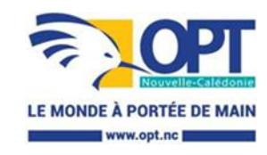

<a href="https://data.gouv.nc/explore/dataset/avis-de-vacances-de-poste-avp-drhfpnc/files/f2ee86096f24dd570796ab925d5b3932/download/" target="_blank" style="display: inline-block; padding: 8px 16px; background-color: #3f51b5; color: white; text-decoration: none; border-radius: 4px;">📄 Télécharger le PDF original</a>

## **DPSP – Chargé(e) de la comitologie et des relations transverses – Service pilotage et performance**

**Référence : 3134-26-0680/SR du 8 mai 2026**

**Employeur : Office des postes et télécommunications**

**Corps ou Cadre d'emploi / Domaine :** Cadre d'exploitation **Direction :** de la poste et des services de proximité

ou Contrôleur

**Lieu de travail :** Nouméa

**Durée de résidence exigée pour le recrutement sur titre (1) :** /

**Date de dépôt de l'offre :** vendredi 8 mai 2026

**Poste à pourvoir :** Susceptible d'être à pourvoir dans le cadre de

la réorganisation

**Date limite de candidature :** vendredi 29 mai 2026

## **Détails de l'offre : Avis de vacances de poste lié à la réorganisation de la Direction de la Poste et des services de proximité**

**Emploi RESPNC :** Responsable qualité et méthodes

**Missions :** Assurer la structuration et le pilotage des relations inter-directions, en formalisant les engagements, contrats de service et instances de gouvernance nécessaires à la continuité et à la performance globale.

Contribuer à la régulation du fonctionnement inter-directions, dans le cadre des orientations validées par la BU.

Place dans l'organigramme : N -2 (par rapport au directeur opérationnel)

Fonction du supérieur hiérarchique directe : chef du service pilotage et performance

Nombre d'agents encadrés : /

- Directs : / - Indirects : /

#### **Activités principales : Structuration de la gouvernance interne**

- Concevoir et organiser les instances de décision (comité, revues, arbitrages)
- Formaliser les règles de fonctionnement, circuits de validation et modalités d'arbitrage
- Garantir la traçabilité et la lisibilité des décisions stratégiques

#### **Organisation des interfaces inter directions**

- Formaliser les contrats internes / accords de services
- Définir les périmètres de responsabilité entre directions
- Sécuriser les interfaces critiques (processus, délais, dépendances)

#### **Régulation des tensions inter directions**

- Partager les difficultés de la direction en comitologie inter-directions ou à l'occasion de réunions spécifiques
- Réguler les conflits de périmètre
- Prévenir les dérives organisationnelles
- Contribuer à la régulation organisationnelle en interne
- Coordonner les réponses ou actions correctives permettant à la direction de contribuer à la satisfaction des besoins des autres directions et/ou partenaires

### **Veille et anticipation**

- Identifier les risques organisationnels
- Anticiper les besoins futurs
- Proposer des évolutions structurelles

#### **Caractéristiques particulières de l'emploi :**

- Habilitations, permis nécessaires pour l'exercice des fonctions : Permis B
- Conditions de travail : /
- Fourniture ou mise à disposition de matériels, biens ou services : /
- Régimes indemnitaires rattachés au poste de travail : /

#### **Profil du candidat Savoir / Connaissance / Diplôme exigé :**

- Environnement administratif, institutionnel et politique
- Conduite et gestion de projet
- Droit/Réglementation
- Organisation, méthode et processus
- Gestion de l'information
- Techniques d'accueil
- Techniques de rédaction

### **Savoir-faire :**

- Analyser un besoin
- Analyser un projet, une démarche
- Contribuer
- Proposer
- Communiquer
- Diffuser une information, une publication
- Animer un réseau, une communauté

#### **Comportement professionnel :**

- Être diplomate
- Aisance relationnelle
- Être rigoureux
- Sens de l'organisation
- Esprit d'initiative
- Être autonome
- Curiosité intellectuelle
- Aisance relationnelle

Les compétences suivies de (\*) pourront être acquises à la suite de la prise de poste via un accompagnement et des formations dispensées au sein de l'office

**Contact et informations complémentaires :** Le chef de projet Tel : 26.79.28

# **POUR RÉPONDRE À CETTE OFFRE**

Les candidatures (CV à jour, lettre de candidature, a minima) précisant la référence de l'offre doivent parvenir à la direction des ressources humaines – service développement des compétences – section recrutement compétences innovation formation initiale prioritairement par mail : [drh-candidature@opt.nc](mailto:drh-candidature@opt.nc)

En cas d'impossibilité de candidater par le biais de la messagerie électronique, les dossiers de candidatures peuvent parvenir par :

- Dépôt physique : Direction générale 2 rue Montchovet, Port Plaisance 98841 Nouméa Cedex
- Voie postale : même adresse

*Les candidatures de fonctionnaires doivent être transmises sous couvert de la voie hiérarchique*