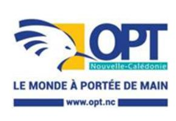

<a href="https://data.gouv.nc/explore/dataset/avis-de-vacances-de-poste-avp-drhfpnc/files/663c6ac3707193bffcfc786c3bd1dd1b/download/" target="_blank" style="display: inline-block; padding: 8px 16px; background-color: #3f51b5; color: white; text-decoration: none; border-radius: 4px;">📄 Télécharger le PDF original</a>

# **DT – Consultant fonctionnel - SMQP**

Référence : 3134-26-0703/SR du 8 mai 2026

**Employeur : Office des Postes et des Télécommunications**

**Corps ou Cadre d'emploi / Domaine :** cadre technique ou **Direction : des télécommunications**

cadre d'exploitation

**Durée de résidence exigée pour le recrutement sur titre (1) :** / **Lieu de travail :** Immeuble Le Fulton à Ducos

**Poste à pourvoir :** dès que possible **Date de dépôt de l'offre :** vendredi 8 mai 2026

**Date limite de candidature :** vendredi 29 mai 2026

## **Emploi RESPNC :**

**Missions :** Piloter l'alignement des SI Télécoms sur les orientations stratégiques et sur les processus métiers

Assurer les activités d'administrateur fonctionnel et transférer/former à cette responsabilité. Contribuer à la performance par la réduction du délai d'implémentation des évolutions du système

d'information

**Activités principales : Unité organisationnelle** : Service méthodes processus qualité

**Place dans l'organigramme** : N-2 (par rapport au directeur opérationnel)

**Fonction du supérieur hiérarchique direct** : Chef de service SMQP

**Nb d'agents encadrés** : /

Direct : / Indirect : /

Gérer l'administration fonctionnelle, le suivi et la communication en situation d'incident et les demandes de support pour les domaines applicatifs suivants :

- Application mobile et site web 1012 NC
- Application mobile Helia NC
- CPP
- Epay : console de suivi des paiements en ligne pour nos différentes boutiques OPT
- SMDP+ (plateforme de gestion eSIM)
- TCRM : gestion des comptes utilisateurs, support des utilisateurs, suivi et communication des incidents

Représenter le métier vis à vis du maître d'œuvre (DSI ou tiers) :

- A ce titre, conduire, produire/faire produire l'ensemble des activités/opérations et livrables de la phase de cadrage à la réception et mise en exploitation des outils du SI.

Accompagner/assister/former les équipes, piloter toute action favorisant la maîtrise et l'autonomie des équipes métiers, la bonne appropriation des différents outils par les utilisateurs.

Rendre compte de l'activité couverte sur tous les volets, l'analyser et en proposer à sa hiérarchie les enseignements /recommandations.

Veiller au respect des attendus décrits dans les référentiels de fonction de l'OPT (Agents)

### **Activités secondaires :**

Exercer ponctuellement le rôle de chef de projet et conduire entre autres, les activités de planification, d'identification/mobilisation/optimisation des ressources et moyens nécessaires, de coordination, de suivi des phases et des livrables, des tests associés, et d'évaluation/suivi des coûts.

Proposer tout moyen/dispositif concourant à la réussite des projets menés et fournir toute information

Contribuer à l'analyse et la maîtrise des risques

Participer aux différents échanges de la communauté Amélioration Continue et Administration fonctionnelle.

## **Caractéristiques particulières de l'emploi :**

Habilitations, permis nécessaires pour l'exercice des fonctions :

Permis B

Conditions de travail :

Fourniture ou mise à disposition de matériels, biens ou services :

Régimes indemnitaires rattachés au poste de travail :

## **Profil du candidat : Savoir / Connaissance / Diplôme exigé :**

Organisation et fonctionnement de l'OPT-NC

- Très bonne connaissance des produits et services télécoms
- Très bonne connaissance des différents SI Télécoms
- Connaissance des processus métiers
- Maitrise d'une méthodologie de gestion de projet (PMP, PMI, Prince 2, Agile…)
- Maitrise des outils de gestion de projets
- Maitrise des outils bureautiques
- Bonne connaissance du domaine fonctionnel impacté
- Anglais : lu, parlé, écrit

### **Savoir-faire :**

- Communiquer efficacement
- Retranscrire un besoin
- Rédiger des cahiers des charges, des spécifications fonctionnelles, des cahiers de tests et des comptes rendus
- Tenir un tableau de bord
- Rendre compte
- Travailler en réseau
- Coordonner

- Prioriser
- Proposer
- Accompagner un changement

### Savoir-être :

Curiosité intellectuelle

- Esprit d'analyse
- Esprit de synthèse
- Esprit d'équipe
- Esprit d'initiative
- Rigueur
- Autonomie
- Sens de l'organisation

Les compétences suivies de (\*) pourront être acquises à la suite de la prise de poste via un accompagnement et des formations dispensées au sein de l'office

**Contact et informations** Pour toute information sur le poste la personne à contacter est :

**complémentaires :** Chef de service SMQP

Tel : (+687)76.11.75

# **POUR RÉPONDRE À CETTE OFFRE**

Votre candidature doit **obligatoirement** comporter les documents suivants :

- Lettre de motivation ;
- Curriculum vitae (CV) détaillé ;
- Fiche de renseignements dûment complétée à [télécharger](https://drhfpnc.gouv.nc/sites/default/files/atoms/files/recrutement_-_fiche_de_renseignements_candidature_vf_0.pdf) ici ;
- Attestation sur l'honneur de non-bénéfice de la rupture conventionnelle à [télécharger](https://drhfpnc.gouv.nc/sites/default/files/atoms/files/attestation_sur_lhonneur_de_non_benefice_de_la_rupture_conventionnelle.pdf) ici ;
- Photocopie des diplômes ;
- Justificatifs concernant la citoyenneté ou la durée de résidence si nécessaire (liste des pièces à fournir dans le document "notice explicative" à [télécharger](https://drhfpnc.gouv.nc/sites/default/files/atoms/files/notice_explicative_emploi_local.pdf) ici .
- Pour les fonctionnaires, demande de changement de corps ou cadre d'emploi si nécessaire à [télécharger](https://drhfpnc.gouv.nc/sites/default/files/atoms/files/formulaire_de_changement_de_corps_ou_de_cadre_demploi.pdf) ici

Tous les documents mentionnés sont issus du site de la DRHFPNC

Votre candidature, précisant la référence de l'offre, doit parvenir à la Direction des ressources humaines, section recrutement **prioritairement** par :

- **Mail** : [DRH-candidature@opt.nc](mailto:DRH-candidature@opt.nc)

En cas d'impossibilité de candidater par le biais de la messagerie électronique, les dossiers de candidatures peuvent parvenir à l'office des Postes et Télécommunications de Nouvelle-Calédonie par :

- Dépôt physique : Direction générale, 2 rue Paul Montchovet, Port Plaisance 98841 Nouméa Cédex
- Voie postale : idem que ci-dessus

*Les candidatures de fonctionnaires doivent être transmises sous couvert de la voie hiérarchique*

Toute candidature incomplète ne pourra être prise en considération