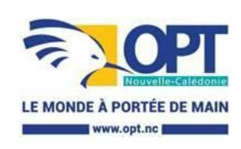

<a href="https://data.gouv.nc/explore/dataset/avis-de-vacances-de-poste-avp-drhfpnc/files/81006fa6d1dba9f4df7c3af15dc01057/download/" target="_blank" style="display: inline-block; padding: 8px 16px; background-color: #3f51b5; color: white; text-decoration: none; border-radius: 4px;">📄 Télécharger le PDF original</a>

# **DT - Assistant Commercial Grands Comptes – Agence entreprises**

**Référence : 3134-26-0714/SR du 8 mai 2026**

**Employeur :** Office des postes et télécommunications

**Corps ou Cadre d'emploi /Domaine** : Contrôleur ou

agent d'exploitation

**Durée de résidence exigée pour le recrutement sur titre :** /

**Postes à pourvoir :** susceptible d'être à pourvoir

**Direction :** Télécom

**Lieu de travail :** Direction générale - Immeuble Waruna - 2 rue Paul Montchovet - Nouméa

**Date limite de candidature :** vendredi 8 mai 2026

**Date de dépôt de l'offre :** vendredi 29 mai 2026

Détails de l'offre :

**Emploi RESPNC : Secrétaire**

**Missions** : Assurer l'administration des ventes en support des chargés d'affaire (GC)

Assurer la relation client

**Unité organisationnelle** : **Agence Entreprises**

**Place dans l'organigramme : N-4** (par rapport au directeur opérationnel)

**Fonction du supérieur hiérarchique direct :** Chef de Section Développement

Clients

### **Nb d'agents encadrés** :

- Directs : / - Indirects : /

# **Activités principales :** Principales :

- Assurer l'assistance commerciale du chargé d'affaires grands comptes
- Accueillir, renseigner, proposer les produits et services aux clients
- Traiter les courriers (électroniques et papiers) en back office
- Traiter les demandes clients et évaluer leurs besoins
- Proposer les offres et établir des devis simples (en fonction de la demande et de la technicité requise) ou solliciter l'intervention d'un chargé d'affaires pour l'ingénierie commerciale et la production d'offres adaptées
- Assurer l'administration des ventes (mise à jour des bases de données, saisie, statistiques...) et le support aux chargés d'affaires (saisie, préparation des réunions clients, préparation et émission des offres...)
- Veiller à la qualité des données clients dans les Systèmes d'Information
- Participer aux actions commerciales (opérations markéting, salons...)
- Assurer le reporting de son activité au chef de section
- Contribuer à la meilleure efficacité collective de l'entité de rattachement par la capacité à tenir d'autre positions, à élever son niveau de pratique, à tutorer (sur la base du volontariat) et conseiller ses collègues

- Garantir une qualité de service en termes d'accueil téléphonique et physique de la clientèle
- Veiller au respect des attendus décrits dans les référentiels de fonction de l'OPT (Agents)

# **Caractéristiques particulières de l'emploi** :

- Habilitations, permis nécessaires pour l'exercice des fonctions : Permis de conduire B
- Conditions de travail : du lundi au samedi en fonction du règlement intérieur

# **Profil du candidat** Savoir / Connaissance/Diplôme exigé :

- Outils informatiques et suite MS 365
- Systèmes d'Information et applications métiers liées aux produits et services vendus
- Techniques rédactionnelles et maîtrise de l'orthographe
- Techniques commerciales et conseil au client
- Produits et services télécoms commercialisés par l'OPT-NC
- Organisation de l'OPT-NC
- Processus métiers et interlocuteurs internes
- Techniques de vente (processus de vente : prospection, accueil client, découverte du besoin, présentation produits, négociation, suivi du client…)..

### Savoir-faire :

- Gérer une relation client
- Analyser un besoin
- Conseiller
- Instruire un dossier
- Argumenter
- Rendre compte
- Synthétiser les informations
- Rédiger des comptes rendus
- S'exprimer à l'oral

### Comportement professionnel :

- Capacité à communiquer
- Sens de la pédagogie
- Aptitude à l'écoute
- Aisance relationnelle
- Sens de l'organisation
- Avoir l'esprit d'équipe
- Etre rigoureux
- Réactivité
- Etre autonome

Les compétences suivies de \* pourront être acquises à la suite de la prise de poste via un accompagnement et des formations dispensées au sein de l'office

**Contact et informations complémentaires :**

Cheffe de section Développement Clients

Tél : 26 77 98

Les candidatures (CV détaillé, lettre de motivation, photocopie des diplômes, fiche de renseignements, attestation sur l'honneur de non bénéfice de la rupture conventionnelle, ainsi que la demande de changement de corps ou cadre d'emplois si nécessaire (2)) précisant la référence de l'offre doivent parvenir à la Direction des ressources humaines, Bureau recrutement, mobilité, accompagnement par :

- Voie postale : Direction Générale 2 rue Montchovet, Port Plaisance 98841 NOUMÉA Cedex
- Dépôt physique (adresse) : idem que ci-dessus
- Mail (adresse) : drh-candidature@opt.nc

(1) Vous trouverez la liste des pièces à fournir afin de justifier de la citoyenneté ou de la durée de résidence dans le document intitulé "Notice explicative : pièces à fournir pour justifier de votre citoyenneté ou de votre résidence" qui est à télécharger directement sur la page de garde des avis de vacances de poste sur le site de la DRHFPNC.

(2) La fiche de renseignements et la demande de changement de corps ou cadre d'emploi sont à télécharger directement sur la page de garde des avis de vacances de poste sur le site de la DRHFPNC. Toute candidature incomplète ne pourra être prise en considération.

*Les candidatures de fonctionnaires doivent être transmises sous couvert de la voie hiérarchique*