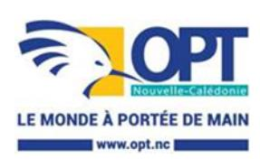

<a href="https://data.gouv.nc/explore/dataset/avis-de-vacances-de-poste-avp-drhfpnc/files/3fbd9fa9f786ac8d4a8b9d9676fba362/download/" target="_blank" style="display: inline-block; padding: 8px 16px; background-color: #3f51b5; color: white; text-decoration: none; border-radius: 4px;">📄 Télécharger le PDF original</a>

### **DT - Responsable produit Télécoms - SMC**

**Référence : 3134-26-0715/SR du 8 mai 2026**

**Employeur : Office des Postes et des Télécommunications**

**Corps ou Cadre d'emploi / Domaine :** cadre d'exploitation **Direction : Télécommunications**

**Durée de résidence exigée**

**pour le recrutement sur titre (1) :** /

**Poste à pourvoir :** susceptible d'être à pourvoir

**Lieu de travail :** Nouméa

**Date de dépôt de l'offre :** vendredi 8 mai 2026

**Date limite de candidature :** vendredi 29 mai 2026

**Emploi RESPNC : chef de produit**

# **Missions :**

Gérer le cycle de vie des offres de produits et services

Concevoir les produits ou services jusqu'aux actions promotionnelles pour favoriser la commercialisation et rechercher les axes d'amélioration en veillant à répondre aux attentes des clients.

**Unité organisationnelle** : Section Marketing

**Place dans l'organigramme** : N-3 (par rapport au directeur opérationnel)

**Fonction du supérieur hiérarchique direct** : Chef de Section Marketing

### **Nb d'agents encadrés** :

Direct : 0 Indirect : 0

- **Activités** Assurer une veille de marché par la collecte et l'analyse des informations internes et externes
  - Étudier les opportunités sous les aspects économiques, organisationnels et commerciaux
  - Positionner les offres en fonction du marché et de la stratégie marketing globale
  - Elaborer/proposer/faire évoluer les offres de produits et services (plan marketing, plan produits) et bâtir le plan d'affaires associé
  - Elaborer les projections et leur hypothèses (segments, CA, pénétration, couverture, concurrence...)
  - Piloter la mise en place technique de l'offre et coordonner de manière transversale les différents services intervenant dans le processus de conception
  - Assurer la représentation marketing lors des réunions de travail et comités de projet internes
  - Produire et diffuser pour les acteurs internes (commerce, exploitation, finance...) des informations commerciales/marché accessibles et synthétiques
  - Concevoir le dispositif relatif à la commercialisation, à l'optimisation des ventes et à l'accompagnement des forces de vente
  - Préparer et suivre la validation des évolutions sur les offres de produits et services en conseil d'administration (préparation des arguments en faveur de l'évolution proposée, rédaction des documents administratifs, etc.)
  - Piloter la mise en œuvre et le déploiement (production, intégration dans les SI, soutien des forces de vente...), évaluer les résultats et proposer les adaptations éventuelles
  - Rendre compte de l'activité sur tous les volets, l'analyser et en proposer à sa hiérarchie les enseignements et recommandations
  - Suivre régulièrement l'évolution des produits et services existants pour adapter la stratégie du plan produit
  - Apporter expertise et conseil aux fonctions marketing logées dans les autres BU
  - Veiller au respect des attendus décrits dans les référentiels de fonction de l'OPT (Agents).

**Caractéristiques particulières de l'emploi :**

Habilitations, permis nécessaires pour l'exercice des fonctions : Permis B

Conditions de travail : Travailler en étroite collaboration avec les différentes parties prenantes, forces commerciales, équipes techniques télécoms et informatiques notamment.

Fourniture ou mise à disposition de matériels, biens ou services /

Régimes indemnitaires rattachés au poste de travail /

### **Profil du candidat : Savoir / Connaissance / Diplôme exigé :**

- Organisation et fonctionnement de l'OPT-NC
- Plan stratégique
- Produits et services de l'Office
- Bases fondamentales du marketing, du développement et de la promotion d'une offre commerciale adaptée aux différents marchés (analyse de marché, marketing mix…)
- Principes généraux d'établissement d'un business plan, d'un budget et de tarification d'une offre
- Techniques de gestion de projet
- Anglais

### **Savoir-faire :**

- Analyser un contexte, un marché, un besoin
- Identifier un enjeu
- Proposer un plan d'action
- Exploiter des informations, des données
- Synthétiser des informations, des données
- Prospecter un marché, une clientèle
- Mobiliser
- Argumenter
- Conduire un projet
- Travailler en réseau

## **Savoir-être :**

- Être autonome
- Avoir l'esprit d'équipe
- Être rigoureux
- Sens de l'organisation
- Être persévérant
- Sens de l'analyse
- Esprit de synthèse
- Aisance relationnelle
- Faculté d'adaptation
- Sens de l'innovation / créativité

Les compétences suivies de (\*) pourront être acquises à la suite de la prise de poste via un accompagnement et des formations dispensées au sein de l'office

**Contact et informations complémentaires :**

Pour toute information sur le poste la personne à contacter est :

Chef de section marketing

Tel : (+687) 26 82 12 ou Mob : (+687) 92 82 02

Les candidatures (CV détaillé, lettre de motivation, photocopie des diplômes, fiche de renseignements, attestation sur l'honneur de non-bénéfice de la rupture conventionnelle, ainsi que la demande de changement de corps ou cadre d'emplois si nécessaire (2)) précisant la référence de l'offre doivent parvenir à la direction des ressources humaines – service développement des compétences – section recrutement compétences innovation formation initiale par :

- Voie postale : Direction générale – 2 rue Montchovet, Port Plaisance – 98841 Nouméa Cedex

- Dépôt physique : même adresse - Mail : DRH-candidature@opt.nc

(1) Vous trouverez la liste des pièces à fournir afin de justifier de la citoyenneté ou de la durée de résidence dans le document intitulé "Notice explicative : pièces à fournir pour justifier de votre citoyenneté ou de votre résidence" qui est à télécharger directement sur la page de garde des avis de vacances de poste sur le site de la DRHFPNC.

(2) La fiche de renseignements, l'attestation sur l'honneur de non-bénéfice de la rupture conventionnelle et la demande de changement de corps ou cadre d'emploi sont à télécharger directement sur la page de garde des avis de vacances de poste sur le site de la DRHFPNC.

Toute candidature incomplète ne pourra être prise en considération.

*Les candidatures de fonctionnaires doivent être transmises sous couvert de la voie hiérarchique*