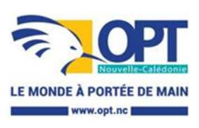

<a href="https://data.gouv.nc/explore/dataset/avis-de-vacances-de-poste-avp-drhfpnc/files/4fac4d8ae02775a03fe834fa53c63be4/download/" target="_blank" style="display: inline-block; padding: 8px 16px; background-color: #3f51b5; color: white; text-decoration: none; border-radius: 4px;">📄 Télécharger le PDF original</a>

# **DT – Chef de section SAV - CPMC**

**Référence : 3134-26-0717/SR du 8 mai 2026**

# **Employeur : Office des postes et télécommunications**

**Corps ou Cadre d'emploi / Domaine :** Cadre technique **Direction des télécommunications**

**Durée de résidence exigée**

**pour le recrutement sur titre (1)** : au moins égale à 10 ans

**Poste à pourvoir :** susceptible d'être à pourvoir **Date de dépôt de l'offre :** vendredi 8 mai 2026

**Date limite de candidature :** vendredi 29 mai 2026

**Lieu de travail :** *206 rue Jacques IEKAWE PK5 - 98841*

**Emploi RESPNC :** pilote d'intervention client

**Missions :** Garantir une continuité et qualité de service optimale au client final par

l'exploitation, la supervision et la maintenance des équipements et réseaux sous sa

responsabilité

Maintenir et développer les compétences de l'équipe

Place dans l'organigramme : N -3 (Par rapport au directeur opérationnel)

*NOUMEA CEDEX*

Fonction du supérieur hiérarchique directe : chef due centre CPMC

#### Nb d'agents permanents encadrés :

● Directs : 3 ● Indirects : 27

- **Activités principales :** Piloter les activités de maintenance des raccordements clients, d'accueil client et en être le référent
  - Organiser et superviser le dispositif permettant la maintenance des équipements et réseaux de la section - garantir la maîtrise des durées d'indisponibilité et la qualité des services opérationnels ainsi rendus
  - Assurer l'ordonnancement et le suivi des travaux des entreprises sous-traitantes de l'OPT pour réaliser la production des raccordements clients ainsi que d'autres travaux divers
  - Identifier les indicateurs pertinents de la performance des services d'exploitation et de maintenance - proposer tout dispositif permettant l'amélioration de ces performances (coûts - qualité - délais ...)
  - Définir les conditions opérationnelles dans lesquelles s'inscrivent les activités d'exploitation et de maintenance (outils, pratiques, processus, référentiels internes et externes ...)
  - Intégrer les politiques internes d'amélioration continue (qualité santé / sécurité / hygiène - RSE...) et de maîtrise des risques (règlementation, risques...) dans les référentiels et pratiques internes
  - Élaborer les budgets prévisionnels en assurer le contrôle et le suivi Participer au suivi des marchés et des opérations sur les équipements de la section
  - Rédiger ou participer à la rédaction des cahiers des charges en termes de spécifications techniques et au lancement des appels d'offres
  - Organiser la veille technologique
  - Animer ou participer à des réunions techniques en interne ou en externe

- Rendre compte de l'activité sur tous les volets, l'analyser et en proposer à sa hiérarchie les enseignements et les recommandations
- Apporter une contribution personnelle sur les sujets d'évolution, transformation et amélioration
- Assurer l'intérim du chef de centre en cas de nécessité
- -Veiller au respect des attendus décrits dans les référentiels de fonction de l'OPT (Agents et managers)

## **Caractéristiques particulières de l'emploi :**

#### Habilitations, permis nécessaires pour l'exercice des fonctions :

Posséder le permis de conduire catégorie B

## Conditions de travail :

Horaires spéciaux (travail hors heures ouvrées) - déplacement principalement sur Nouméa et périphérie, parfois sur l'ensemble de la Nouvelle-Calédonie

# Fourniture ou mise à disposition de matériels, biens ou services :

Tél mobile d'exploitation

### **Profil du candidat Savoir / Connaissance / Diplôme exigé :**

- Bonnes connaissances sur les équipements de téléphonie fixe (cuivre ou fibre optique), RNIS, TRUNK SIP, IPBX, des installations terminales d'abonnés et des règles d'ingénierie propres à ces produits et services
- Connaissances en bureautique informatique : Outlook, Word, Excel, PowerPoint, Visio
- Techniques de communication et d'information
- Techniques de gestes et postures
- Règles d'hygiène et sécurité

#### **Savoir-faire :**

- Manager
- Transmettre un savoir, une technique, une compétence
- Synthétiser des informations, des données, un document
- Gérer une relation client
- Prioriser
- Elaborer un budget
- Travailler en mode projet

#### **Comportement professionnel :**

Être rigoureux

- Esprit d'initiative
- Être autonome
- Faire preuve de leadership
- Aisance relationnelle
- Avoir l'esprit d'équipe
- Faculté d'adaptation
- Sens des responsabilités
- Sens du service public

Les compétences suivies de (\*) pourront être acquises à la suite de la prise de poste via un accompagnement et des formations dispensées au sein de l'office

**Contact et informations complémentaires :**

Chef du centre CPMC

Fixe : +687 41.34.01 / Mobile : +687 746.946

# **POUR RÉPONDRE À CETTE OFFRE**

Les candidatures (CV détaillé, lettre de motivation, photocopie des diplômes, fiche de renseignements, attestation sur l'honneur de non bénéfice de la rupture conventionnelle, ainsi que la demande de changement de corps ou cadre d'emplois si nécessaire (2)) précisant la référence de l'offre doivent parvenir à la direction des ressources humaines – service développement des compétences – section recrutement compétences innovation formation initiale par :

- Voie postale : Direction générale – 2 rue Montchovet, Port Plaisance – 98841 Nouméa Cedex

- Dépôt physique : même adresse

- Mail : mobilite.rh@opt.nc

(1) Vous trouverez la liste des pièces à fournir afin de justifier de la citoyenneté ou de la durée de résidence dans le document intitulé "Notice explicative : pièces à fournir pour justifier de votre citoyenneté ou de votre résidence" qui est à télécharger directement sur la page de garde des avis de vacances de poste sur le site de la DRHFPNC.

(2) La fiche de renseignements, l'attestation sur l'honneur de non-bénéfice de la rupture conventionnelle et la demande de changement de corps ou cadre d'emploi sont à télécharger directement sur la page de garde des avis de vacances de poste sur le site de la DRHFPNC.

Toute candidature incomplète ne pourra être prise en considération.

*Les candidatures de fonctionnaires doivent être transmises sous couvert de la voie hiérarchique*