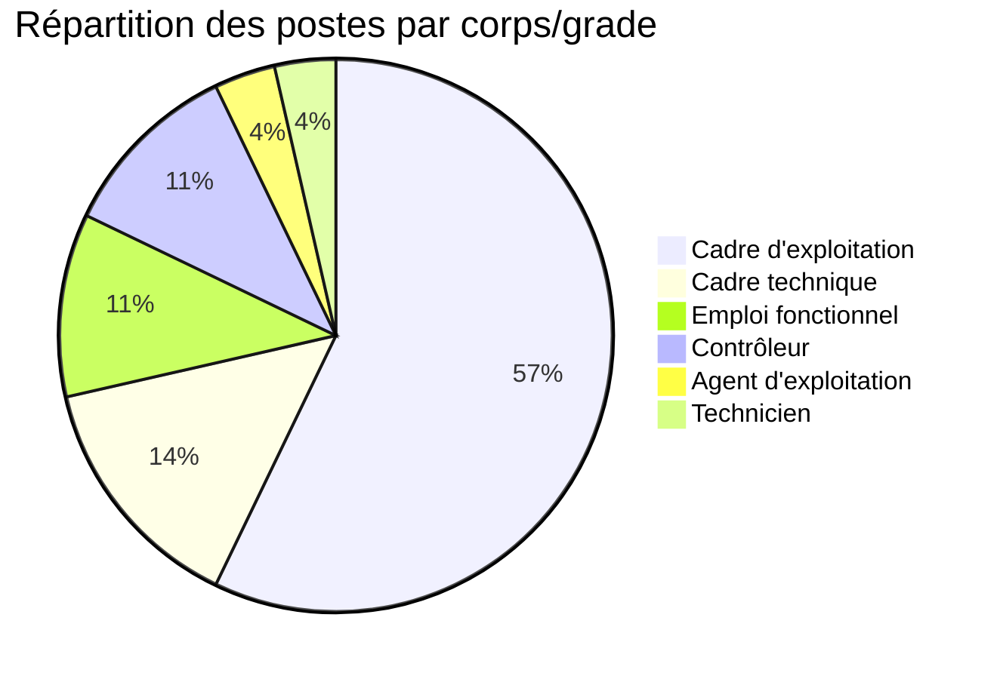

# AVPS OPT-NC

Bienvenue sur le site des **Avis de Vacances de Poste** de l'Office des Postes et Télécommunications de Nouvelle-Calédonie.

## 📊 En bref

- **28** postes disponibles actuellement
- 📅 Dernière mise à jour : **13/05/2026 à 12h27** (Nouméa)
- 🔄 Prochaine mise à jour : demain à 00h00 (automatique)

### 📈 Répartition par corps/grade

---

## 📋 Postes disponibles

Cette page recense les avis de vacances de poste publiés par l'OPT-NC, issus du dataset [avis-de-vacances-de-poste-avp-drhfpnc](https://data.gouv.nc/explore/dataset/avis-de-vacances-de-poste-avp-drhfpnc/information) disponible sur data.gouv.nc.

👉 **Retrouvez également les AVP sur le [site institutionnel OPT-NC](https://office.opt.nc/fr/emploi-et-carriere/postuler-lopt-nc/avp)**

### Liste des AVP disponibles

!!! info "26-0717 - Chef de section SAV - CPMC"
    **🏢 Direction :** Office des postes et télécommunications (OPT)  
    **📅 Date limite :** 28/05/2026  
    **💼 Corps :** Cadre technique  
    
    [📖 Voir les détails](26-0717/){ .md-button } [📄 Télécharger le PDF](https://data.gouv.nc/explore/dataset/avis-de-vacances-de-poste-avp-drhfpnc/files/4fac4d8ae02775a03fe834fa53c63be4/download/){ .md-button .md-button--primary target="_blank" }

!!! info "26-0715 - Responsable produit Télécoms - SMC"
    **🏢 Direction :** Office des postes et télécommunications (OPT)  
    **📅 Date limite :** 28/05/2026  
    **💼 Corps :** Cadre d'exploitation  
    
    [📖 Voir les détails](26-0715/){ .md-button } [📄 Télécharger le PDF](https://data.gouv.nc/explore/dataset/avis-de-vacances-de-poste-avp-drhfpnc/files/3fbd9fa9f786ac8d4a8b9d9676fba362/download/){ .md-button .md-button--primary target="_blank" }

!!! info "26-0714 - Assistant commercial Grands Comptes - Agence entreprises"
    **🏢 Direction :** Office des postes et télécommunications (OPT)  
    **📅 Date limite :** 28/05/2026  
    **💼 Corps :** Contrôleur  
    
    [📖 Voir les détails](26-0714/){ .md-button } [📄 Télécharger le PDF](https://data.gouv.nc/explore/dataset/avis-de-vacances-de-poste-avp-drhfpnc/files/81006fa6d1dba9f4df7c3af15dc01057/download/){ .md-button .md-button--primary target="_blank" }

!!! info "26-0713 - Technicien Section Energie - CERT 🟢"
    **🏢 Direction :** Office des postes et télécommunications (OPT)  
    **📅 Date limite :** 28/05/2026  
    **💼 Corps :** Technicien  
    **⚡ Disponibilité :** Immédiate  
    
    [📖 Voir les détails](26-0713/){ .md-button } [📄 Télécharger le PDF](https://data.gouv.nc/explore/dataset/avis-de-vacances-de-poste-avp-drhfpnc/files/2e3d1325aa2af87327dd876f0a22d6c6/download/){ .md-button .md-button--primary target="_blank" }

!!! info "26-0712 - Chef(fe) de centre - Agence Entreprises 🟢"
    **🏢 Direction :** Office des postes et télécommunications (OPT)  
    **📅 Date limite :** 28/05/2026  
    **💼 Corps :** Cadre technique  
    **⚡ Disponibilité :** Immédiate  
    
    [📖 Voir les détails](26-0712/){ .md-button } [📄 Télécharger le PDF](https://data.gouv.nc/explore/dataset/avis-de-vacances-de-poste-avp-drhfpnc/files/c3432e374d09377b3c2b9ec9fb2e004a/download/){ .md-button .md-button--primary target="_blank" }

!!! info "26-0705 - Responsable  Cybersécurité et Résilience Réseau 🟢"
    **🏢 Direction :** Office des postes et télécommunications (OPT)  
    **📅 Date limite :** 28/05/2026  
    **💼 Corps :** Cadre technique  
    **⚡ Disponibilité :** Immédiate  
    
    [📖 Voir les détails](26-0705/){ .md-button } [📄 Télécharger le PDF](https://data.gouv.nc/explore/dataset/avis-de-vacances-de-poste-avp-drhfpnc/files/2a6abf2880b0a5ed17a785a419098c96/download/){ .md-button .md-button--primary target="_blank" }

!!! info "26-0703 - Consultant fonctionnel - SMQP 🟢"
    **🏢 Direction :** Office des postes et télécommunications (OPT)  
    **📅 Date limite :** 28/05/2026  
    **💼 Corps :** Cadre technique  
    **⚡ Disponibilité :** Immédiate  
    
    [📖 Voir les détails](26-0703/){ .md-button } [📄 Télécharger le PDF](https://data.gouv.nc/explore/dataset/avis-de-vacances-de-poste-avp-drhfpnc/files/663c6ac3707193bffcfc786c3bd1dd1b/download/){ .md-button .md-button--primary target="_blank" }

!!! info "26-0692 - Assistant(e) commercial(e) - section expérience commerciale"
    **🏢 Direction :** Office des postes et télécommunications (OPT)  
    **📅 Date limite :** 28/05/2026  
    **💼 Corps :** Contrôleur  
    
    [📖 Voir les détails](26-0692/){ .md-button } [📄 Télécharger le PDF](https://data.gouv.nc/explore/dataset/avis-de-vacances-de-poste-avp-drhfpnc/files/9823d4ecc9f978c0f17ca7444f040689/download/){ .md-button .md-button--primary target="_blank" }

!!! info "26-0691 - Chargé(e) de l'animation commerciale - section expérience commerciale"
    **🏢 Direction :** Office des postes et télécommunications (OPT)  
    **📅 Date limite :** 28/05/2026  
    **💼 Corps :** Cadre d'exploitation  
    
    [📖 Voir les détails](26-0691/){ .md-button } [📄 Télécharger le PDF](https://data.gouv.nc/explore/dataset/avis-de-vacances-de-poste-avp-drhfpnc/files/3eb212cf7e1ca947d2656bdb7bb29b2c/download/){ .md-button .md-button--primary target="_blank" }

!!! info "26-0690 - Administrateur des pratiques métiers - section applications et pratiques métiers"
    **🏢 Direction :** Office des postes et télécommunications (OPT)  
    **📅 Date limite :** 28/05/2026  
    **💼 Corps :** Cadre d'exploitation  
    
    [📖 Voir les détails](26-0690/){ .md-button } [📄 Télécharger le PDF](https://data.gouv.nc/explore/dataset/avis-de-vacances-de-poste-avp-drhfpnc/files/60e51e47713579732ce575c556125c7d/download/){ .md-button .md-button--primary target="_blank" }

!!! info "26-0689 - Chargé(e) de l'innovation digitale et data - service support métiers"
    **🏢 Direction :** Office des postes et télécommunications (OPT)  
    **📅 Date limite :** 28/05/2026  
    **💼 Corps :** Cadre d'exploitation  
    
    [📖 Voir les détails](26-0689/){ .md-button } [📄 Télécharger le PDF](https://data.gouv.nc/explore/dataset/avis-de-vacances-de-poste-avp-drhfpnc/files/7ecf1941502ac2eb55beb522708b9f33/download/){ .md-button .md-button--primary target="_blank" }

!!! info "26-0688 - Chef(fe) de section Applications et pratiques métiers - service support métiers"
    **🏢 Direction :** Office des postes et télécommunications (OPT)  
    **📅 Date limite :** 28/05/2026  
    **💼 Corps :** Cadre d'exploitation  
    
    [📖 Voir les détails](26-0688/){ .md-button } [📄 Télécharger le PDF](https://data.gouv.nc/explore/dataset/avis-de-vacances-de-poste-avp-drhfpnc/files/17abc4467919a0b7961a06beaf9a9620/download/){ .md-button .md-button--primary target="_blank" }

!!! info "26-0687 - Chef(fe) de service support métiers"
    **🏢 Direction :** Office des postes et télécommunications (OPT)  
    **📅 Date limite :** 28/05/2026  
    **💼 Corps :** Cadre d'exploitation  
    
    [📖 Voir les détails](26-0687/){ .md-button } [📄 Télécharger le PDF](https://data.gouv.nc/explore/dataset/avis-de-vacances-de-poste-avp-drhfpnc/files/ae05306e02d1e2fc0aa99f1807ffb447/download/){ .md-button .md-button--primary target="_blank" }

!!! info "26-0686 - Chargé(e) de relation client et vente - section relation clientèle"
    **🏢 Direction :** Office des postes et télécommunications (OPT)  
    **📅 Date limite :** 28/05/2026  
    **💼 Corps :** Agent d'exploitation  
    
    [📖 Voir les détails](26-0686/){ .md-button } [📄 Télécharger le PDF](https://data.gouv.nc/explore/dataset/avis-de-vacances-de-poste-avp-drhfpnc/files/a563169faf59c5df48fdf8059ab0c0ff/download/){ .md-button .md-button--primary target="_blank" }

!!! info "26-0685 - Che(fe) de service pilotage et performance - service pilotage et performance"
    **🏢 Direction :** Office des postes et télécommunications (OPT)  
    **📅 Date limite :** 28/05/2026  
    **💼 Corps :** Cadre d'exploitation  
    
    [📖 Voir les détails](26-0685/){ .md-button } [📄 Télécharger le PDF](https://data.gouv.nc/explore/dataset/avis-de-vacances-de-poste-avp-drhfpnc/files/cf4866af38a7fb470d87d1cea71286a0/download/){ .md-button .md-button--primary target="_blank" }

!!! info "26-0684 - Chef(fe) de projet - Service Pilotage et Performance"
    **🏢 Direction :** Office des postes et télécommunications (OPT)  
    **📅 Date limite :** 28/05/2026  
    **💼 Corps :** Cadre d'exploitation  
    
    [📖 Voir les détails](26-0684/){ .md-button } [📄 Télécharger le PDF](https://data.gouv.nc/explore/dataset/avis-de-vacances-de-poste-avp-drhfpnc/files/050299f7287ff459b4b93265507000a9/download/){ .md-button .md-button--primary target="_blank" }

!!! info "26-0683 - Chef(fe) de section appui métiers - Service support métiers"
    **🏢 Direction :** Office des postes et télécommunications (OPT)  
    **📅 Date limite :** 28/05/2026  
    **💼 Corps :** Cadre d'exploitation  
    
    [📖 Voir les détails](26-0683/){ .md-button } [📄 Télécharger le PDF](https://data.gouv.nc/explore/dataset/avis-de-vacances-de-poste-avp-drhfpnc/files/ba04d006d18c243971867db4d7ce2902/download/){ .md-button .md-button--primary target="_blank" }

!!! info "26-0682 - Référent(e) Ressources Humaines - Section appui stratégique"
    **🏢 Direction :** Office des postes et télécommunications (OPT)  
    **📅 Date limite :** 28/05/2026  
    **💼 Corps :** Cadre d'exploitation  
    
    [📖 Voir les détails](26-0682/){ .md-button } [📄 Télécharger le PDF](https://data.gouv.nc/explore/dataset/avis-de-vacances-de-poste-avp-drhfpnc/files/09fb9f450860caae2bd0cb292c4069e4/download/){ .md-button .md-button--primary target="_blank" }

!!! info "26-0681 - Chef(fe) de section appui stratégique - service pilotage et performance"
    **🏢 Direction :** Office des postes et télécommunications (OPT)  
    **📅 Date limite :** 28/05/2026  
    **💼 Corps :** Cadre d'exploitation  
    
    [📖 Voir les détails](26-0681/){ .md-button } [📄 Télécharger le PDF](https://data.gouv.nc/explore/dataset/avis-de-vacances-de-poste-avp-drhfpnc/files/fbe87dd1f912b7f4848ccdf93eaa943e/download/){ .md-button .md-button--primary target="_blank" }

!!! info "26-0680 - Chargé(e) de la comitologie et des relations transverses - Service pilotage e..."
    **🏢 Direction :** Office des postes et télécommunications (OPT)  
    **📅 Date limite :** 28/05/2026  
    **💼 Corps :** Cadre d'exploitation  
    
    [📖 Voir les détails](26-0680/){ .md-button } [📄 Télécharger le PDF](https://data.gouv.nc/explore/dataset/avis-de-vacances-de-poste-avp-drhfpnc/files/f2ee86096f24dd570796ab925d5b3932/download/){ .md-button .md-button--primary target="_blank" }

!!! info "26-0679 - Assistant(e) Ressources Humaines études et projets -Section appui stratégique"
    **🏢 Direction :** Office des postes et télécommunications (OPT)  
    **📅 Date limite :** 28/05/2026  
    **💼 Corps :** Contrôleur  
    
    [📖 Voir les détails](26-0679/){ .md-button } [📄 Télécharger le PDF](https://data.gouv.nc/explore/dataset/avis-de-vacances-de-poste-avp-drhfpnc/files/1a28affa4ab4cce7e61bc586b48be681/download/){ .md-button .md-button--primary target="_blank" }

!!! info "26-0678 - Directeur(trice)"
    **🏢 Direction :** Office des postes et télécommunications (OPT)  
    **📅 Date limite :** 28/05/2026  
    **💼 Corps :** Emploi fonctionnel  
    
    [📖 Voir les détails](26-0678/){ .md-button } [📄 Télécharger le PDF](https://data.gouv.nc/explore/dataset/avis-de-vacances-de-poste-avp-drhfpnc/files/84717a3117f23e088a30bf7045f280e8/download/){ .md-button .md-button--primary target="_blank" }

!!! info "26-0677 - Chef(fe) de service expérience client - service expérience client 🟢"
    **🏢 Direction :** Office des postes et télécommunications (OPT)  
    **📅 Date limite :** 28/05/2026  
    **💼 Corps :** Cadre d'exploitation  
    **⚡ Disponibilité :** Immédiate  
    
    [📖 Voir les détails](26-0677/){ .md-button } [📄 Télécharger le PDF](https://data.gouv.nc/explore/dataset/avis-de-vacances-de-poste-avp-drhfpnc/files/b7d87ca4a8ed288bb9da1d14d9e31900/download/){ .md-button .md-button--primary target="_blank" }

!!! info "26-0676 - Chargé(e) de portefeuille de projets- Direction 🟢"
    **🏢 Direction :** Office des postes et télécommunications (OPT)  
    **📅 Date limite :** 28/05/2026  
    **💼 Corps :** Cadre d'exploitation  
    **⚡ Disponibilité :** Immédiate  
    
    [📖 Voir les détails](26-0676/){ .md-button } [📄 Télécharger le PDF](https://data.gouv.nc/explore/dataset/avis-de-vacances-de-poste-avp-drhfpnc/files/e864a210c69917ea7f294e1ca5569b58/download/){ .md-button .md-button--primary target="_blank" }

!!! info "26-0675 - Directeur(trice) adjoint(e) relations clients - pôle opérationnel 🟢"
    **🏢 Direction :** Office des postes et télécommunications (OPT)  
    **📅 Date limite :** 28/05/2026  
    **💼 Corps :** Emploi fonctionnel  
    **⚡ Disponibilité :** Immédiate  
    
    [📖 Voir les détails](26-0675/){ .md-button } [📄 Télécharger le PDF](https://data.gouv.nc/explore/dataset/avis-de-vacances-de-poste-avp-drhfpnc/files/ea8867dc80a7731127d238eb603c6e81/download/){ .md-button .md-button--primary target="_blank" }

!!! info "26-0674 - Chef(fe) de section expérience commerciale - Service expérience client 🟢"
    **🏢 Direction :** Office des postes et télécommunications (OPT)  
    **📅 Date limite :** 28/05/2026  
    **💼 Corps :** Cadre d'exploitation  
    **⚡ Disponibilité :** Immédiate  
    
    [📖 Voir les détails](26-0674/){ .md-button } [📄 Télécharger le PDF](https://data.gouv.nc/explore/dataset/avis-de-vacances-de-poste-avp-drhfpnc/files/72dc9702fec70e5de6ae91def4b6ca7d/download/){ .md-button .md-button--primary target="_blank" }

!!! info "26-0673 - Chargé(e) de partenariats - service Expérience client 🟢"
    **🏢 Direction :** Office des postes et télécommunications (OPT)  
    **📅 Date limite :** 28/05/2026  
    **💼 Corps :** Cadre d'exploitation  
    **⚡ Disponibilité :** Immédiate  
    
    [📖 Voir les détails](26-0673/){ .md-button } [📄 Télécharger le PDF](https://data.gouv.nc/explore/dataset/avis-de-vacances-de-poste-avp-drhfpnc/files/2726adfeb7e9c3259fe2523b269f192e/download/){ .md-button .md-button--primary target="_blank" }

!!! info "26-0672 - Directeur(trice) adjoint(e) expérience client -pôle fonctionnel"
    **🏢 Direction :** Office des postes et télécommunications (OPT)  
    **📅 Date limite :** 28/05/2026  
    **💼 Corps :** Emploi fonctionnel  
    
    [📖 Voir les détails](26-0672/){ .md-button } [📄 Télécharger le PDF](https://data.gouv.nc/explore/dataset/avis-de-vacances-de-poste-avp-drhfpnc/files/b4f556b149b543de0eca299c6848adde/download/){ .md-button .md-button--primary target="_blank" }

## 📝 Comment postuler ?

Pour candidater à un poste :

1. **Consultez l'offre** qui vous intéresse ci-dessus
2. **Téléchargez le PDF** pour connaître tous les détails et critères requis
3. **Préparez votre dossier** de candidature selon les modalités indiquées dans l'AVP
4. **Déposez votre candidature** avant la date limite auprès du service RH de l'OPT-NC

💡 **Plus d'informations** : Rendez-vous sur le [site institutionnel OPT-NC](https://office.opt.nc/fr/emploi-et-carriere/postuler-lopt-nc/avp) pour connaître les modalités de candidature et les contacts RH.

---

## 🔄 Mise à jour

Les données sont mises à jour quotidiennement de manière automatique.

---

*Données extraites du dataset [avis-de-vacances-de-poste-avp-drhfpnc](https://data.gouv.nc/explore/dataset/avis-de-vacances-de-poste-avp-drhfpnc) disponible sur data.gouv.nc*
